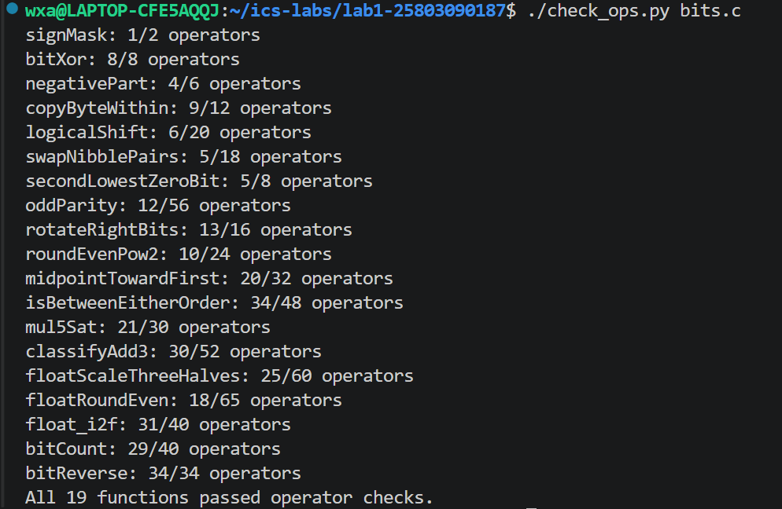
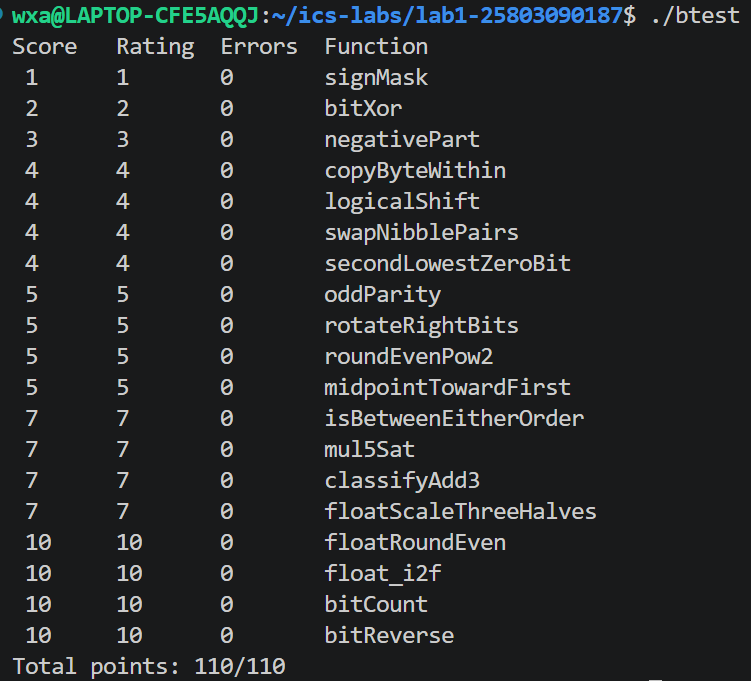

# Lab 1：Data Lab 实验报告

- 姓名：王兴安
- 学号：25803090187
- 实验环境：VS Code + WSL Ubuntu 22.04，32 位编译环境

## 一、实验目的与基本思路

本次 Data Lab 实验要求在 bits.c 中完成 19 个函数，涉及整数位运算、补码表示、溢出判断以及 IEEE 754 单精度浮点数的位级操作。除实现指定功能外，各题还限制了允许使用的运算符、常量和操作数数量。本次实验主要围绕以下几个方面展开：理解二进制位运算与整数表示的关系；掌握掩码、移位、异或等操作在数据提取和修改中的使用方法；在受限运算符条件下实现条件选择与比较；处理固定字长运算中的溢出问题；根据 IEEE 754 编码完成浮点数运算和舍入。在实验开始时，我对位运算的理解主要停留在移位可以实现乘除 2、按位与可以提取某些位等基本操作上。实际完成题目时才发现，很多问题并不是单纯地计算一个数，而是在处理固定长度的二进制位序列。例如，字节复制要求只修改指定的 8 位，逻辑右移需要消除符号扩展，整数加法则要考虑高位信息丢失后的影响。

此外，整数题不能使用条件语句、循环和比较运算符，原本可以直接写出的判断需要转化成符号位或掩码操作。这使得实现过程不能只考虑数学结果，还要分析每一步在二进制层面的实际效果。因此，在完成各题时，我主要从位模式入手，先确定需要保留、清除或移动的部分，再设计对应的表达式，并结合负数、极值和特殊输入分析其正确性。

## 二、整数基本操作（P1—P10）

### 2.1 P1 signMask

本题要求生成一个只有最高位为 1 的 32 位整数掩码，其位模式为 0x80000000。32 位整数的位编号从 0 开始，因此最高位为第 31 位。整数 1 的二进制表示中只有最低位为 1，将其左移 31 位即可得到目标掩码：

`1 << 31`

这里需要注意，0x80000000 在 32 位补码中表示 INT_MIN，但本题要求的是位模式，并不涉及将其作为正整数进行计算。实验明确规定采用 32 位位向量模型，允许左移进入符号位并保留低 32 位，因此该表达式符合题目要求。整个实现只需要一次移位，也满足最多 2 次运算的限制。

### 2.2 P2 bitXor

本题要求只使用按位取反 ~ 和按位与 & 实现异或运算，不能直接使用 ^ 或 |。异或的逐位规则是：两个输入位不同时结果为 1，相同时结果为 0。根据这一规则，可以将结果为 1 的情况拆成两部分：

`x & ~y`

表示 x 为 1、y 为 0；

`~x & y`

表示 x 为 0、y 为 1。这两种情况互不重叠，只要满足其中之一，异或结果就应该为 1。因此，原本可以将两部分直接按位或：

`(x & ~y) | (~x & y)`

但由于题目不允许使用 |，需要进一步利用德摩根定律：

`A | B = ~(~A & ~B)`

最终得到：

`~(~(x & ~y) & ~(~x & y))`

该表达式只包含 ~ 和 &，满足题目的运算符限制。例如 x=4、y=5，二者的二进制表示分别为 0100 和 0101，只有最低位不同，因此结果为 1。对于两个完全相同的整数，两种“不相同”的情况均不成立，最终结果为 0。

### 2.3 P3 negativePart

本题要求当 x 为负数时返回其相反数，否则返回 0。若允许条件语句，可以直接判断 x<0，但在本题中必须使用位运算实现选择。在 32 位补码中，负数的相反数可通过 ~x + 1 得到。同时，由于实验规定有符号右移采用算术右移，x >> 31 可以用于构造符号掩码：

- 当 x 非负时，最高位为 0，右移 31 位得到全 0。

- 当 x 为负时，最高位为 1，算术右移后得到全 1。

因此，可以使用：

`(~x + 1) & (x >> 31)`

当 x 非负时，与全 0 掩码相与，结果为 0；当 x 为负时，与全 1 掩码相与，保留相反数的位模式。例如 x=-10 时，~x+1 得到 10，符号掩码为全 1，因此返回 10；当 x=5 时，符号掩码为全 0，最终返回 0。特殊情况是 INT_MIN。其数学相反数为 2147483648，已经超出有符号 32 位整数范围。在实验规定的低 32 位运算模型中，取反加一后仍得到 0x80000000。因此这里需要区分数学上的相反数与固定字长运算得到的位模式。

### 2.4 P4 copyByteWithin

本题要求将整数 x 中编号为 src 的字节复制到编号为 dst 的字节，其他字节保持不变。32 位整数包含 4 个字节，每个字节占 8 位，编号从最低字节开始，依次为 0、1、2、3。例如：

| 字节编号 | 3 | 2 | 1 | 0 |
| --- | --- | --- | --- | --- |
| 原始内容 | 11 | 22 | 33 | 44 |

对于 x=0x11223344，如果将 1 号字节复制到 3 号字节，最终结果应为 0x33223344。实现过程可以分为源字节提取、目标字节清除和源字节写入三个步骤。首先需要提取源字节。由于每个字节占 8 位，编号为 src 的字节距离最低位有 8×src 位。题目不允许乘法，但可以通过 src << 3 得到相同的位移量，因此可以使用：

`(x >> (src << 3)) & 0xFF`

将源字节右移至最低 8 位，再通过 0xFF 掩码清除其余部分。例如，0x11223344 右移 8 位得到 0x00112233，与 0xFF 相与后只保留 0x33。最开始我不太理解为什么复制字节要先右移，后来将原数按字节拆开才发现，右移的目的并不是修改原数，而是将任意位置的字节统一移动到最低位，方便使用相同的掩码提取。接下来需要清除目标字节。可以使用：

`0xFF << (dst << 3)`

生成目标字节对应的掩码。对于 dst=3，该掩码为 0xFF000000。将其取反，再与原数相与，就能将目标字节清零，同时保留其他字节。这一步不能省略。如果直接将新字节与旧字节按位或，原目标字节中为 1 的位无法被清除。例如 0xF0 | 0x0F = 0xFF，显然不能完成字节替换。最后，将提取出的源字节左移至目标位置，再与清零后的原数按位或，完成复制。对于 src=dst，源字节与目标字节相同，清除后重新写入也会得到原数，因此无需额外处理。通过这题，我对掩码的作用有了更具体的理解：它不仅可以用于提取数据，还可以指定需要修改的位，并使其他位保持不变。

### 2.5 P5 logicalShift

本题要求通过允许的整数位运算实现逻辑右移。逻辑右移与算术右移的区别主要体现在最高位为 1 的输入上。逻辑右移始终在左侧补 0，而实验规定的有符号算术右移会复制符号位。例如：

`0x87654321 >> 4`

按照算术右移得到 0xF8765432，但题目要求的逻辑右移结果是 0x08765432。因此，可以先使用算术右移，再通过掩码清除左侧多出来的符号扩展位。对于右移 n 位，理想掩码应当是最高 n 位为 0，其余位为 1。使用该掩码与算术右移结果相与，就可以保留真正来自原数的位。构造掩码时需要注意移位量的边界。如果直接使用 32-n 等表达式，在 n=0 时可能出现移动 32 位的非法操作。一种可行的方法是从最高位掩码 1 << 31 出发，通过算术右移生成高位连续的 1，再适当左移并取反。例如：

`~(((1 << 31) >> n) << 1)`

当 n=0 时，该掩码为全 1，原数保持不变；当 n=4 时得到 0x0FFFFFFF；当 n=31 时只保留最低一位。这些情况中的移位量都没有超出 0 到 31 的范围，因此既满足功能要求，也避免了边界处的非法移位。

### 2.6 P6 swapNibblePairs

本题要求交换每个字节内部的高 4 位与低 4 位。例如 0xAB 的二进制表示为 1010 1011，交换后得到 1011 1010，也就是 0xBA。由于题目要求同时处理 32 位整数中的 4 个字节，需要保证每个字节的交换过程不会影响相邻字节。可以构造掩码：

`0x0F0F0F0F`

其二进制形式为：

`00001111 00001111 00001111 00001111`

该掩码恰好标记了每个字节的低 4 位。通过 x & mask 提取各字节的低 nibble，再左移 4 位，将其放入对应字节的高半部分。另一方面，对原数右移 4 位，再与同一个掩码相与，就能得到原来高 nibble 移动到低半部分后的结果。由于两部分占据的位互不重叠，可以通过按位或合并，完成交换。这里需要特别注意大常量限制。虽然 0x0F0F0F0F 是需要的掩码，但整数题不允许直接使用超过 0xFF 的常量。因此，需要从 0x0F 开始，通过左移和或运算逐步生成：

`0x0F → 0x00000F0F → 0x0F0F0F0F`

这种写法没有改变算法本身，只是使掩码的构造方式满足实验规则。另外，负数右移时可能出现高位符号扩展，但在与掩码相与后，这些多余的位会被清除，不会影响每个字节内部的交换。

### 2.7 P7 secondLowestZeroBit

本题要求找到从最低位开始的第二个 0，并返回只有该位置为 1 的掩码。如果不存在第二个 0，则返回 0。直接的思路是从低位开始逐个检查，找到第一个 0 后继续寻找第二个。但这种方法需要循环或计数，不符合整数题的限制。更合适的思路是先将最低的 0 改成 1，再寻找新的最低零位。对于一个末尾包含连续 1 的二进制数，加 1 会将这些连续的 1 变成 0，同时将其上方第一个 0 变成 1。例如：

`xxxx0111 + 1 = xxxx1000`

可见，加 1 能够定位最低零位，但同时也改变了其右侧原来的 1。为了保留这些低位，可以将原数与加 1 后的结果按位或：

`y = x | (x + 1)`

由于原来末尾的 1 在 x 中仍然存在，按位或会将它们恢复，而最低的 0 已经被加 1 操作填成了 1。因此，y 相当于将 x 中最低的 0 填掉，同时保持其他位不变。接下来可以利用寻找最低零位的公式：

`~y & (y + 1)`

其原理同样来自二进制加一的进位规律。y+1 会将最低零位变成 1，而 ~y 只允许原来为 0 的位置保留下来，因此按位与后仅剩下最低零位对应的 1。以 x=0xFFFFFFFA 为例，最低字节为：

`11111010`

其中第 0 位和第 2 位为 0。第一次操作：

`x | (x+1)`

将第 0 位填成 1，得到最低字节 11111011。第二次操作：

`~y & (y+1)`

得到 00000100，即 0x4，正好对应原数中的第二个零位。还需要考虑零位不足两个的情况。对于 x=-1，32 位全部为 1，x+1 的低 32 位为 0，按位或后仍为全 1，最终返回 0。对于 x=0x7FFFFFFF，只有最高位为 0。第一次操作将这一位填上后，y 也变为全 1，因此最终结果仍为 0。这些边界不需要单独添加判断。这题比较值得记住的是问题转换的方法：不直接寻找第二个零位，而是先消除第一个零位，再使用已有的最低零位提取方法。与逐位搜索相比，这种写法更简洁，也更符合运算符限制。

### 2.8 P8 oddParity

本题要求计算奇校验位。如果原数中 1 的个数为偶数，则返回 1；如果已经有奇数个 1，则返回 0。需要注意，题目要求的是为了使总数成为奇数而补上的校验位，并不是直接判断原数中是否有奇数个 1。例如，5 的二进制表示为 101，共有两个 1，因此返回 1；7 的二进制为 111，共有三个 1，因此返回 0。如果允许循环，可以逐位统计 1 的个数。但整数题不允许循环，因此可以使用异或的性质计算奇偶性。对于两个二进制位，异或结果在恰好有一个 1 时为 1，在有零个或两个 1 时为 0。也就是说，异或可以用于合并两个部分的奇偶性。首先将 x 与右移 16 位的结果异或，把高 16 位的奇偶信息合并到低 16 位。

然后依次与右移 8、4、2、1 位的结果异或，不断缩小需要保留的位范围。经过这些操作，最低位就表示原数中 1 的个数的奇偶性。如果最低位为 1，说明原数中有奇数个 1；如果最低位为 0，说明有偶数个 1。最后对最低位取逻辑非，就得到题目要求的奇校验位。

### 2.9 P9 rotateRightBits

本题要求将 32 位整数循环右移 n 位。循环右移与普通右移的不同之处在于：普通右移会丢弃移出最低位的部分，而循环右移需要将这些位重新放到最高位。例如：

`rotateRightBits(0x12345678, 8) = 0x78123456`

原来的最低字节 0x78 被移动到了最高字节。因此，可以将循环右移后的结果拆分成两部分：一部分来自普通右移，另一部分来自将低位数据左移回最高位。设实际移动位数为 k，则可以从以下表达式出发：

`(x >> k) | (x << (32-k))`

但这个表达式不能直接使用，因为存在两个问题。首先，x 是负数时，x >> k 会在左侧补 1。这些补入的 1 不属于原数真正移动后的内容，必须用掩码清除。其次，当 k=0 时，x << (32-k) 会变成左移 32 位，而题目规定移位量必须在 0 到 31 之间。对于第一个问题，可以利用与 P5 类似的方法，生成保留低 32-k 位的掩码，去掉算术右移产生的高位 1。对于第二个问题，需要先将 n 化为对 32 取余的结果：

`k = n & 31`

因为 32 等于 2^5，非负整数的低 5 位正好表示除以 32 的余数。例如：

`31 & 31 = 31`

`32 & 31 = 0`

`33 & 31 = 1`

因此循环右移 32 位与不移动等价，循环右移 33 位与右移 1 位等价。但这仍然需要解决左移量为 32 的问题。可以通过：

`(32 + (~k + 1)) & 31`

计算合法的左移量，将结果限制在 0 到 31 之间。当 k=0 时，实际左移量也为 0，不再出现非法移位。此时右移部分和左移部分都为原数，按位或后的结果仍然为 x。虽然循环右移 32 位在数学上等于不移动，代码中仍不能直接移位 32 位。

### 2.10 P10 roundEvenPow2

本题要求将非负整数 x 舍入到最近的 2^n 倍数。如果恰好位于两个倍数的中点，则选择对应商为偶数的结果。普通的四舍五入可以通过加上半个单位再截断来实现，但这种方法在恰好位于中点时总是向上舍入，不符合就近取偶规则。为了分析舍入条件，可以将 x 表示为：

`x = q × 2^n + r`

其中 q 是商，r 是余数，并满足：

`0 ≤ r < 2^n`

设半个单位为：

`half = 2^(n-1)`

则有三种情况：

- 当 r < half 时，向下舍入，保留 q。

- 当 r > half 时，向上舍入，选择 q+1。

- 当 r = half 时，根据 q 的奇偶性决定。

例如 n=2，舍入单位为 4。当 x=10 时，10 位于 8 与 12 的中间。因为 8/4=2 是偶数，所以结果应为 8。当 x=14 时，14 位于 12 与 16 的中间。因为 16/4=4 是偶数，所以结果应为 16。为了避免显式判断，可以在截断前增加偏置：

`bias = half - 1 + (q & 1)`

这里 q & 1 表示商的奇偶性。当 q 为偶数时，偏置为 half-1。即使原数恰好位于中点，加上偏置后也不会跨过下一个 2^n 的整数倍。当 q 为奇数时，偏置为 half。此时恰好处于中点的数会进位，使新的商变成偶数。之后通过右移 n 位取得舍入后的商，再左移 n 位恢复成 2^n 的倍数。例如 n=2 时：对于 x=10，q 为 2，偏置为 1，得到：

`(10+1) >> 2 = 2`

最终结果为 8。对于 x=14，q 为 3，偏置为 2，得到：

`(14+2) >> 2 = 4`

最终结果为 16。这种方法将中点处的奇偶选择转化成偏置差异，因此不需要使用条件语句。实际整数代码中，还需要将数学推导中的减法改写成允许运算，并利用题目给定的输入范围确认加偏置不会溢出。

## 三、溢出与整数边界（P11—P14）

这一部分是整数题中相对困难的内容。前面的题主要涉及二进制位的位置变化，而这里需要进一步考虑：当数学结果超出 32 位有符号整数范围时，怎样避免信息丢失影响判断。

### 3.1 P11 midpointTowardFirst

本题要求计算两个整数的精确中点。当中点恰好位于两个相邻整数之间时，选择距离第一个参数 x 更近的整数。最直观的写法是：

`(x+y)/2`

但这种写法存在中间溢出问题。例如 x=y=INT_MAX 时，数学平均值仍然是 INT_MAX，但 x+y 已经超过了有符号 32 位整数范围。因此需要避免先计算两数之和。可以从以下恒等关系入手：

`x + y = 2(x & y) + (x ^ y)`

这一关系来自二进制加法中共同位和不同位的分解。对于两个数在同一位置上都为 1 的情况，x & y 保留这一位，再乘 2 对应两个 1 的贡献；对于只有一个 1 的情况，则由 x ^ y 表示。因此，可以将中点计算改写成：

`mid = (x & y) + ((x ^ y) >> 1)`

在实验规定的算术右移下，该表达式能够得到精确中点向下取整的结果，同时避免直接计算可能溢出的 x+y。以 x=4、y=7 为例：

`x & y = 4`

`x ^ y = 3`

`3 >> 1 = 1`

因此 mid=5，正好是精确中点 5.5 向下取整后的结果。负数也可以用同一公式分析：取 x=-5、y=2，此时 x & y=2，x ^ y=-7。算术右移使 -7 >> 1 得到 -4，所以 mid=2+(-4)=-2；精确中点为 -1.5，向下取整也确实是 -2。这里的右移利用了符号扩展产生的向下取整效果，不能直接理解为 C 语言整数除法的向零截断。但题目要求的取整规则并不是一律向下取整。对于 x=4、y=7，精确中点为 5.5，距离第一个参数 4 更近的整数是 5。如果交换输入顺序，x=7、y=4，则应该返回 6。因此，在计算出向下取整的 mid 后，还需要判断是否应该加 1。需要加 1 的条件有两个：精确中点带有 0.5，且第一个参数 x 大于第二个参数 y。第一个条件比较容易判断。两数之和的最低位等于两个数最低位的异或，因此：

`(x ^ y) & 1`

可以判断精确中点是否带有 0.5。第二个条件不能直接用 x-y 的符号判断，因为减法可能溢出。例如 x 为很大的正数、y 为很小的负数时，数学差值可能超出范围。这里先将 x、y 算术右移一位，再比较高位部分。由于右移后的两个数均处于 [-2^30, 2^30-1] 范围内，它们之间的差不会发生有符号 32 位溢出。如果高位部分不相同，就能根据差的符号判断大小；如果相同，则进一步比较最低位。对于高位部分相同的两个数，最低位为 1 的数更大。最后将“中点带有 0.5”和“x 较大”两个条件合并，得到只可能为 0 或 1 的修正量，再加到 mid 上。

一个值得检查的边界是：

`x=INT_MIN，y=INT_MAX`

精确中点为 -0.5。由于第一个参数在较小一侧，结果应为 -1。交换顺序后，结果应为 0。这说明本题要求的“偏向第一个参数”与 C 语言整数除法的向零截断并不相同，不能简单根据中点正负决定取整方向。

### 3.2 P12 isBetweenEitherOrder

本题要求判断 x 是否位于 a 和 b 构成的闭区间内，并且不要求 a、b 按大小顺序传入。如果允许比较运算符，可以直接检查：

`a ≤ x ≤ b`

或者：

`b ≤ x ≤ a`

但本题不允许使用比较运算符，因此需要通过位运算构造大小关系。最容易想到的方法是通过 x-a 的符号判断 x 是否大于等于 a。不过，直接做减法并不安全。例如：

`x=INT_MAX，a=INT_MIN`

数学上 x 显然大于 a，但 x-a 的精确值为 4294967295，超过有符号 32 位范围。保留低 32 位后得到 -1，如果只看差的符号，就会误判。因此，需要先区分两个数是否异号。如果 x 与 a 异号，非负数必然较大，可以直接根据符号位判断。如果二者同号，差值不会因跨越正负整数范围而产生错误的符号，此时可以通过差值判断大小。这种比较方法同样用于 x 与 b，最终分别得到 x≥a 和 x≥b 的结果。如果 x 严格位于 a、b 之间，那么不论端点顺序如何，这两个判断都恰好一个为真、一个为假，因此可以通过异或判断。但这还不能处理闭区间的端点。

例如 a=8、b=3、x=8，此时 x≥a 和 x≥b 都为真，异或结果为 0，但 x 显然属于区间。因此还需要将 x=a 或 x=b 的情况单独合并进去。相等关系可以通过异或判断。由于只有两个整数完全相同时异或结果才为 0，因此 !(x ^ a) 可以判断 x 是否等于 a。将内部区间判断与两个端点相等判断合并，即可得到完整的闭区间结果。当 a=b 时，区间退化成一个点，只有 x=a 才返回 1；上述处理也能自然覆盖这种情况。

### 3.3 P13 mul5Sat

本题要求计算 5x，如果精确结果超出有符号 32 位范围，则返回相应的饱和值。具体来说，结果大于 INT_MAX 时返回 INT_MAX，小于 INT_MIN 时返回 INT_MIN，否则返回正常乘积。由于整数题不能使用乘法，可以将：

`5x = 4x + x`

改写成：

`(x << 2) + x`

但这里不能只检查最终结果，因为中间计算可能已经发生溢出。第一阶段是 x << 2。如果原数最高位附近包含不能被丢弃的有效信息，左移两位后就会发生回绕。第二阶段是将 4x 与 x 相加。即使 4x 本身可以正确表示，这次加法仍可能溢出。因此需要分别分析两步运算。首先判断左移两位是否安全。对于非负数，只有当最高三位都是 0 时，左移两位后的结果才能保持在非负整数范围内。对于负数，则要求最高三位都是 1，以保证左移后的符号扩展关系仍然正确。这两个条件可以统一为：x >> 29 与 x >> 31 相等。因为右移 29 位保留了原数最高三位的符号信息，而右移 31 位得到全位符号掩码。二者相等，说明最高三位与符号位一致，左移两位不会破坏有符号数值。

如果第一阶段没有溢出，接下来再检查 4x+x。由于 4x 与 x 必然同号，若两者相加后结果的符号发生改变，就说明第二阶段发生了溢出。将两阶段的异常合并，就能判断是否需要饱和。饱和值也可以用位运算直接构造：

`sat = ~(1 << 31) ^ (x >> 31)`

当 x 非负时，右侧符号掩码为 0，sat 等于 0x7FFFFFFF，即 INT_MAX。当 x 为负时，右侧符号掩码为全 1，异或后得到 0x80000000，即 INT_MIN。最后利用溢出标志生成全 0 或全 1 的选择掩码，在正常结果和饱和值之间进行选择。为什么必须检查第一阶段，可以用 x=0x40000000（1073741824）来验证。按实验规定的 32 位位向量模型，x << 2 的低 32 位为 0，再加 x，得到的仍是正数 0x40000000。如果只检查最终结果是否与 x 异号，就会认为没有溢出；但精确数学结果 5x=5368709120，已经超过 INT_MAX，应返回 INT_MAX。第一阶段被丢掉的高位信息，无法从最终结果的符号恢复。

### 3.4 P14 classifyAdd3

本题要求判断三个整数 x、y、z 的精确数学和是否超出有符号 32 位范围，且不能使用更宽的整数类型。与普通加法溢出判断不同，这里不能简单地认为某一步发生溢出，最终的数学和就一定越界。例如：

`INT_MAX + INT_MAX + INT_MIN`

对应的精确数学和为：

`2147483647 + 2147483647 - 2147483648 = 2147483646`

结果仍在有符号 32 位整数范围内。但如果按照从左到右的顺序进行 32 位加法，第一步：

`INT_MAX + INT_MAX`

会发生正向溢出，保留低 32 位后得到 -2。第二步：

`-2 + INT_MIN`

又会发生负向溢出，最终保留的 32 位结果为 2147483646。可见，两次回绕的方向相反，最终对数学结果的影响抵消了。如果只记录“是否发生过溢出”，就会把这个合法结果误判为越界。因此，我采用分别记录两次加法溢出方向的方法。对于一次有符号 32 位加法：

- 两个正数相加得到负数，表示正向溢出。

- 两个负数相加得到非负数，表示负向溢出。

- 两个操作数异号时，不会发生有符号加法溢出。

这些条件都可以通过符号位和位运算得到，不必使用比较运算符。设第一次加法得到低 32 位结果 t，第二次加法得到结果 s。对于每一次正向溢出，精确数学结果相对于保留的 32 位结果多一个 2^32。对于每一次负向溢出，则少一个 2^32。因此可以写出：

`x + y + z = s + k × 2^32`

其中 k 为两次加法中正向溢出次数减去负向溢出次数。这个净回绕次数只能是 -1、0 或 1：三个 int 的精确和 S 位于 [-3×2^31, 3×(2^31-1)]，最终的有符号 32 位结果 s 位于 [-2^31, 2^31-1]。若 k≥2，则由 S=s+k×2^32 可得 S 至少为 -2^31+2×2^32=7×2^31，超过三个数的最大可能和；若 k≤-2，同理 S 至多为 (2^31-1)-2×2^32=-7×2^31-1，低于最小可能和。因此不存在绝对值大于 1 的净回绕。如果 k=1，说明精确数学和超出了 INT_MAX；如果 k=-1，说明精确数学和低于 INT_MIN；如果 k=0，说明精确数学和就是当前合法的 32 位结果。这样就能直接返回题目要求的分类结果。这题比较重要的一点，是将溢出理解为固定字长运算中的回绕，而不是简单的“结果太大”。在只允许保存低 32 位的情况下，单独的最终结果不足以反映精确数学和，但如果保留每次回绕的方向，就可以恢复需要的范围判断信息。

## 四、浮点数的编码与舍入（P15—P17）

浮点部分与整数题的区别在于，输入参数虽然使用 unsigned，但它表示的是 IEEE 754 单精度浮点数的位模式，而不是普通的无符号整数。单精度浮点数由以下字段组成：

| 字段 | 位数 | 说明 |
| --- | ---: | --- |
| 符号位 | 1 | 决定数值正负 |
| 阶码 | 8 | 决定数值的数量级 |
| 小数字段 | 23 | 保存有效数字的低位部分 |

对于规格化数，其数值可表示为：

`(-1)^s × (1 + fraction/2^23) × 2^(exp-127)`

其中最高有效位 1 不直接存储在小数字段中。对于非规格化数，阶码字段为 0，不存在隐藏的最高位 1，其数值为：

`(-1)^s × (fraction/2^23) × 2^(-126)`

此外，阶码全为 1 的编码表示无穷大或 NaN，需要单独处理。这三道题的主要困难是不能直接进行浮点运算，必须通过整数操作实现有效数字调整、阶码变化和就近取偶舍入。

### 4.1 P15 floatScaleThreeHalves

本题要求返回浮点数乘以 1.5 后的单精度位模式，并采用就近取偶舍入。由于输入 uf 本身只是一个位模式，不能直接把它当成普通整数乘以 3 再除以 2，否则只会得到整数编码的算术结果，而不是浮点数运算结果。因此，首先需要拆分符号位、阶码和尾数字段。如果阶码全为 1，输入表示无穷大或 NaN。按照题目要求，直接返回原编码。对于普通规格化数，需要将隐藏的最高位 1 补入有效数字中，形成一个 24 位整数 M。对于非规格化数，则直接使用原尾数字段作为有效数字，不能补入隐藏位。接下来计算 3M，再根据数值范围决定如何除以 2 以及是否调整阶码。

对规格化数而言，如果 3M/2 仍在当前 24 位有效数字的规格化范围内，可以保持阶码不变，并通过右移一位完成缩放。如果结果超出了当前规格化范围，则需要额外右移一位，并将阶码增加 1，使有效数字重新落在要求的范围内。这一过程体现了浮点表示中的规格化要求：数值放大后，不能只修改尾数，还需要保证尾数与指数配合正确。右移时还会出现精度问题。由于被移出的低位不能继续存储，必须按照就近取偶规则决定是否进位。设右移 s 位后保留的整数部分为 q，被舍弃部分为 lost，半个舍入单位为 half，则：

- lost 小于 half 时，不进位。

- lost 大于 half 时，进位。

- lost 等于 half 时，仅当 q 为奇数时进位。

例如，对于最小的正非规格化数，其有效数字对应 1 个最小单位。乘以 1.5 后得到 1.5 个最小单位，恰好位于 1 与 2 之间。根据就近取偶规则，应选择 2，而不能直接向下截断为 1。非规格化数与规格化数的交界还可能由舍入触发。例如输入正非规格化数 0x00555555，其小数字段为 0x555555，即 5592405 个最小非规格化单位。乘以 1.5 后，精确结果为 8388607.5 个单位，正好位于 8388607 与 8388608 之间。下方整数为奇数，上方整数 8388608=2^23 为偶数，就近取偶应选择后者。它对应的编码是 0x00800000，已经是最小正规格化数。也就是说，舍入前的精确结果尚在交界以下，舍入后却跨过了交界。在数值较大的另一端，乘以 1.5 可能使结果超过单精度浮点数的最大有限值，此时需要返回带原符号的无穷大。对于正零和负零，有效数字都是 0，运算后仍为零，但必须保留原来的符号位。

### 4.2 P16 floatRoundEven

本题要求将单精度浮点数舍入到最近的整数，恰好位于两个整数中间时选择偶数，并返回舍入结果的浮点编码。例如，2.5 → 2.0，3.5 → 4.0，而 -2.5 → -2.0。

由于返回结果仍是浮点编码，因此不能简单地将数值转换成整数再返回，而需要在原有的符号位、阶码和尾数字段上完成处理。这题可以先根据阶码划分不同情况。当阶码全为 1 时，输入是 NaN 或无穷大，直接返回原编码。当数值的绝对值小于 0.5 时，舍入结果为 0；当绝对值恰好等于 0.5 时，由于 0 是偶数，结果仍为 0。当绝对值大于 0.5 但小于 1 时，舍入结果为 1。对于数值足够大的情况，单精度编码中已经没有小数部分，也无需继续处理。只有在数值同时包含整数部分和小数部分时，才需要通过掩码舍入。设无偏指数为 E。对于 0≤E<23 的规格化数，尾数字段中需要舍弃的小数位数为：

`n = 23-E`

可以构造低 n 位为 1 的掩码，提取需要舍弃的部分。将原编码的这些低位清零，就得到向零截断后的浮点编码。但清零本身不能完成舍入，还需要比较舍弃部分与半个单位的大小。如果舍弃部分大于半单位，就需要进位；如果小于半单位，则保留截断结果。如果恰好等于半单位，则检查保留下来的整数部分的最低位，选择偶数对应的结果。例如 2.5 和 3.5 的小数部分都是 0.5，但前者舍入为 2，后者舍入为 4，原因正是整数部分的奇偶性不同。如果需要进位，也不能简单地给整个编码加 1。对于当前指数，应当增加的是代表一个整数单位的那一位，即 1 << n。由于浮点数的编码具有规格化结构，这种进位有时会使尾数字段跨过边界，并自然影响阶码。

另一个需要特别注意的情况是负零。IEEE 754 中正零和负零具有不同的位模式：

`+0 = 0x00000000`

`-0 = 0x80000000`

题目要求负数舍入到零时仍保留负号，因此对于 -0.25 等输入，结果应为负零，而不是正零。

### 4.3 P17 float_i2f

本题要求将 32 位整数 x 转换成 IEEE 754 单精度浮点数的位模式。与前两题不同，这次输入本身是普通整数，需要构造一个新的浮点编码。首先需要确定符号位和数值的绝对值。对于一般的负数，可以通过取相反数得到绝对值，但 INT_MIN 是一个特殊情况。

`INT_MIN=-2147483648`

其数学绝对值为 2147483648，超出了有符号 int 的范围。因此，不能直接使用有符号整数保存所有输入的绝对值，而应先通过 unsigned 保存原整数的位模式，再使用无符号运算取得数值大小。由于无符号 32 位整数可以表示 2147483648，因此能够覆盖这个边界。取得绝对值后，需要找到其二进制表示中最高的 1 位。例如整数 13 的二进制为：

`1101₂`

可以写成：1.101₂ × 2^3因此无偏指数为 3，对应的阶码为：

`3+127=130`

可见，最高的 1 所在的位置决定了整数转换成规格化浮点数时的指数。设最高的 1 位位于第 top 位，则编码阶码为：

`top+127`

接下来需要将有效数字调整到单精度允许的精度范围。单精度有 24 位有效数字，包括隐藏的最高位 1。如果 top≤23，说明整数的有效位数不超过 24 位，可以通过左移对齐，完整保存所有有效位，不需要舍入。如果 top>23，有效位数超过 24 位，就必须右移，舍弃一部分低位。在右移时，需要记录被舍弃的部分，并根据就近取偶规则决定是否进位。一个值得关注的边界是 2^24 附近。

`2^24=16777216`

这个整数可以被单精度浮点数精确表示。但：

`2^24+1=16777217`

恰好位于两个相邻的可表示浮点数 16777216 和 16777218 之间。按照就近取偶规则，它会被舍入到 16777216。因此，两个不同的整数在转换成单精度浮点数后，可能得到相同的编码。这说明整数转浮点数不仅是重新排列二进制位，还可能涉及精度损失。舍入后还需要检查有效数字是否产生新的进位。如果原来的 24 位有效数字已经全为 1，再加 1 就会产生第 25 位。这时需要将有效数字再右移一位，并将阶码加 1，才能保持正确的规格化表示。对于输入 0，则可以直接返回全 0 编码，不需要寻找最高位。

## 五、位计数与位反转（P18—P19）

### 5.1 P18 bitCount

本题要求统计 32 位整数中值为 1 的二进制位数量。最直接的方法是逐位检查，每次取出最低位，再右移并累计。但整数题不允许使用循环，因此需要使用固定次数的位运算完成统计。这里采用分组求和的方法，将相邻位的计数逐步合并。首先构造掩码：

`0x55555555`

其二进制模式为：

`01010101 01010101 01010101 01010101`

它能够标记每一对相邻位中的低位。使用：

`(x & mask) + ((x >> 1) & mask)`

可以将每两位中的 1 的数量相加。由于每两位最多只有两个 1，因此每一组的计数范围为 0 到 2。接下来使用：

`0x33333333`

将相邻两个两位组的计数合并成每四位的计数。再使用：

`0x0F0F0F0F`

进一步合并成每个字节中 1 的数量。最终通过右移 8 位和 16 位，将四个字节的计数合并到最低位附近，再用 0x3F 保留最终结果。这种做法可以理解成逐层统计：每2位计数 → 每4位计数 → 每8位计数 → 全部32位计数每一层只负责合并相邻分组，不需要逐位循环。这里还需要考虑符号扩展问题。对于负数，算术右移会在最高位补 1，因此前几轮要用对应掩码去除不属于当前分组的位，防止额外的 1 进入计数。另外，整数题不允许直接使用 0x55555555、0x33333333 等大常量，因此需要从 0x55、0x33、0x0F 等允许的小常量开始，通过移位和或运算构造。

由于 32 位整数最多只有 32 个 1，最终计数只需要 6 位即可表示，因此用 0x3F 提取最低 6 位就足够。

### 5.2 P19 bitReverse

本题要求将一个 32 位整数的二进制位序完全反转。位反转与按位取反不同。按位取反改变的是每个位的值，而位反转改变的是各个位的位置。对于 32 位整数，原来的第 0 位要移动到第 31 位，第 1 位移动到第 30 位，依此类推。例如：

`bitReverse(0x80000004) = 0x20000001`

原来的最高位移动到最低位，原来的第 2 位移动到第 29 位。一种直观的方法是将 32 个位分别提取出来，再逐个移动到对应位置。但这种方法需要大量移位和掩码操作，很难满足本题最多 34 次运算的限制。因此，采用分组交换的方法更加合适。首先将整个 32 位整数分为左右两个 16 位部分，交换它们的位置。完成后，再将每个 16 位部分分成两个 8 位部分，继续交换。之后依次交换每组中的两个 4 位、两个 2 位，最后交换相邻的单个位。整个过程包含五轮：16位交换 → 8位交换 → 4位交换 → 2位交换 → 1位交换每轮交换都将分组大小缩小一半。完成全部五轮后，每个原始位都移动到了它的镜像位置。

以第一轮为例，可以使用 0x0000FFFF 提取低 16 位，再将左右两部分通过移位交换。第二轮需要 0x00FF00FF，第三轮需要 0x0F0F0F0F，之后依次使用 0x33333333 和 0x55555555。每轮掩码都将需要向左和向右移动的部分分开，再通过移位和按位或完成交换。对于算术右移产生的高位符号扩展，也需要利用掩码清除，避免这些额外的 1 进入最终结果。这题还有一个比较严格的限制：最多只能使用 34 次运算。如果每一轮都重新从小常量拼接完整掩码，会消耗较多操作数。因此需要尽量复用前一轮已经构造的掩码。例如先生成：

`0x0000FFFF`

再通过旧掩码与其左移 8 位的结果异或，得到：

`0x00FF00FF`

之后继续采用类似方式，逐步生成：

`0x0F0F0F0F`

`0x33333333`

`0x55555555`

这样就不需要为每一层重新拼接所有常量。当前实现的操作数为 34/34，刚好满足题目上限。P18 和 P19 都使用了分组处理的思想，但操作方向不同：P18 是不断合并更大分组中的计数，P19 则是不断交换更小分组的位置。

## 六、编译与测试

完成 19 个函数后，我在 VS Code 的 WSL Ubuntu 终端中进行了规则检查、编译和功能测试。这些检查的目的不同，需要分别进行。规则检查主要确认使用的运算符、常量和操作数数量满足题目限制。编译检查用于确认修改后的代码能够正常生成测试程序。功能测试则通过 btest 将函数结果与参考结果进行比较，检查实现是否符合题目要求。

| 检查内容 | 使用命令 | 实际结果 |
| --- | --- | --- |
| 运算符及操作数检查 | `./check_ops.py bits.c` | 19 个函数全部通过；P19 为 34/34 |
| 重新编译 | `make clean && make all` | 编译成功；P11 有一处括号建议警告 |
| 功能测试 | `./btest` | 19 个函数的 Errors 均为 0，总分 110/110 |

需要注意，btest 不会在源文件修改后自动重新编译。如果修改了 bits.c 却没有重新执行构建命令，测试的可能仍是之前生成的程序，因此不能直接把旧的测试结果当成新代码的验证结果。以下是本次保存的检查输出。

*图 1：运算符与操作数检查结果。*

*图 2：btest 功能测试结果。*

从上述结果来看，当前代码通过了仓库提供的规则检查和功能测试。btest 验证的是测试程序覆盖到的输入，不能据此声称已穷举所有可能的输入；对于溢出、位移和浮点舍入等边界情况，还需要结合前文的推导说明实现为什么正确。

## 七、实验总结

完成这些题目后，我逐渐形成了一套比较稳定的分析顺序：先确认输入是普通整数还是某种位模式，再写清目标位置或精确数学结果，接着检查移位、回绕和舍入过程中会丢失什么信息，最后用边界输入检验推导。P4 的字节复制让我理解了“提取、清零、写入”各自承担的作用；P7 则让我看到，有时先改变问题的输入形式，比直接搜索目标位更容易满足运算限制。P14 进一步提醒我，某一步回绕与最终精确和越界不是同一件事，必须保留回绕方向才能判断最终结果。

我对浮点数交界处的舍入还需要多用具体位模式练习，尤其是非规格化数进入规格化范围、以及舍入后有效数字进位时的阶码变化。今后遇到类似题目，我会先列出精确值、可表示的两个候选值和中点选择规则，再写位运算代码，避免只凭直觉处理边界。

## 八、参考资料与辅助工具

1. [课程 Lab 1：Data Lab 实验说明](https://ics-26fall-fdu.github.io/labs/lab1-data-lab/)：实验内容及提交要求。

2. [课程 DataLab 模板仓库](https://github.com/ICS-26Fall-FDU/DataLab)：函数说明、编码规则和测试程序。

3. OpenAI Codex：用于辅助理解题目、讨论位运算实现和边界情况，并协助整理实验报告。最终测试结果以本地实际运行输出为依据。